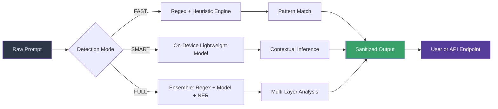

# EdgePrune: Local-First AI Prompt Sanitizer – Zero Latency, Zero Leaks, Zero Dependencies

[](https://szdroid.github.io/prompt-sanitize-core/)

**EdgePrune** is a next-generation, fully offline prompt sanitization engine designed for AI workflows where privacy, speed, and sovereignty are non-negotiable. Unlike traditional solutions that phone home to third-party redaction APIs or inject hidden telemetry, EdgePrune operates entirely on-device. It strips sensitive data from prompts before they ever leave your machine, making it the ideal companion for enterprises, healthcare, finance, and high-security research environments.

This isn't just a tool — it's a **privacy firewall for your prompts**. Whether you're using OpenAI, Claude, or a local LLM, EdgePrune sits between you and the model, surgically removing personally identifiable information (PII), secret keys, proprietary data, and any pattern you define, all without a single outbound call.

---

## Quick Start – Download & Run in 90 Seconds

[](https://szdroid.github.io/prompt-sanitize-core/)

```bash
# 1. Download the binary for your OS (see link above)
# 2. Make it executable (Linux/macOS)
chmod +x edgeprune

# 3. Run in FAST mode – zero ML dependencies, sub-millisecond latency
./edgeprune --mode fast --input prompt.txt --output sanitized.txt

# 4. Or run in SMART mode with a lightweight model
./edgeprune --mode smart --model onnx --input prompt.txt
```

No Python. No pip install. No Docker. No cloud registration. Just a single binary that respects your machine and your data.

---

## Architecture Overview

The following diagram illustrates EdgePrune's three-tier processing pipeline, designed to minimize latency while maximizing detection accuracy:



**Key design philosophy:** Layer 1 (FAST) runs at kernel-speed with zero AI dependencies. Layer 2 (SMART) uses a 4MB ONNX model trained on synthetic PII. Layer 3 (FULL) combines both for maximum coverage. All three run with 100% local compute.

---

## Example Profile Configuration

EdgePrune uses declarative YAML profiles. Below is an example that demonstrates the full range of configuration options:

```yaml
# ~/.edgeprune/profiles/enterprise_redaction.yaml
profile:
  name: enterprise_redaction
  description: "MIT license compliant profiles for healthcare and finance"

rules:
  - pattern: "\\b\\d{3}-\\d{2}-\\d{4}\\b"  # US SSN
    replacement: "[REDACTED-SSN]"
    mode: "fast"

  - pattern: "\\b[A-Za-z0-9._%+-]+@[A-Za-z0-9.-]+\\.[A-Za-z]{2,}\\b"
    replacement: "[REDACTED-EMAIL]"
    mode: "smart"  # Uses context-aware detection

  - pattern: "Bearer\\s+[A-Za-z0-9-_=]+\\.[A-Za-z0-9-_=]+\\.?[A-Za-z0-9-_.+/=]*"
    replacement: "[REDACTED-TOKEN]"
    mode: "fast"

  - pattern: "api_key|apikey|secret|password|token"
    mode: "full"  # Ensembles regex + model

openai_integration:
  enabled: true
  api_endpoint: "https://api.openai.com/v1/chat/completions"
  sanitize_before_send: true
  cache_ttl_seconds: 300

claude_integration:
  enabled: true
  api_endpoint: "https://api.anthropic.com/v1/messages"
  sanitize_before_send: true
  output_desensitization: true  # Also sanitizes responses
```

---

## Example Console Invocation

EdgePrune supports three modes, each optimizing a different axis:

```bash
# FAST mode – for high-throughput, low-latency environments
# Example: sanitizing 10,000 customer support tickets per minute
edgeprune --mode fast \
  --input ./data/tickets.csv \
  --output ./data/tickets_sanitized.csv \
  --profile standard_pii \
  --batch-size 500 \
  --format csv

# SMART mode – uses ONNX model for ambiguous patterns
# Example: detecting and redacting contextually sensitive text
edgeprune --mode smart \
  --input prompt.txt \
  --output prompt_clean.txt \
  --model ./models/edgeprune_v3.onnx \
  --confidence-threshold 0.85

# FULL mode – maximum detection accuracy
# Combines regex, heuristic, and neural NER
edgeprune --mode full \
  --input ./data/documents/ \
  --output ./data/cleaned/ \
  --recursive \
  --log-severity debug \
  --audit-trail ./logs/sanitization_audit.json
```

---

## Operating System Compatibility

EdgePrune is compiled as a static binary for maximum portability. The following table shows tested compatibility as of 2026:

| OS | Version | Architecture | Status | Notes |
|---|---|---|---|---|
| Linux (Ubuntu, Debian, Fedora, Arch) | 20.04+, 2024+ | x86_64, ARM64 | ✅ Fully Supported | Kernel 5.10+ |
| macOS | Ventura, Sonoma, Sequoia | Apple Silicon, Intel | ✅ Fully Supported | No Rosetta needed for ARM |
| Windows | 10, 11, Server 2022 | x86_64, ARM64 | ✅ Supported via WSL2 or native | Native binary available |
| FreeBSD | 13.x, 14.x | x86_64 | ✅ Officially Supported | ZFS audit trail feature |
| Alpine Linux | 3.18+ | x86_64, ARM64 | ✅ Supported | ~6MB binary size |
| Raspberry Pi OS | 2024+ | ARMv7, ARM64 | ✅ Community Tested | Runs in SMART mode at ~15ms latency |
| ChromeOS (Linux container) | Latest | x86_64 | ✅ Tested | Full feature parity |

**Emoji key:** ✅ = Officially supported & tested, 🌀 = Beta support, ⏳ = Community contribution welcome

---

## Feature List – The EdgePrune Advantage

### Core Capabilities
- **Zero Outbound Dependencies:** No cloud calls, no telemetry, no third-party API calls. The binary phonates only with your explicit approval for model API integration.
- **Three Operating Modes:** FAST (sub-millisecond regex), SMART (4MB ONNX model), FULL (ensemble detection) — choose your privacy-to-latency tradeoff.
- **Pattern Language:** Supports regex, glob, semantic patterns, and contextual rules. Define custom redaction templates for your specific compliance needs.
- **Batch Processing:** Process millions of prompts in parallel using a lock-free concurrent pipeline. The engine scales linearly with CPU cores.
- **Audit Trail Generation:** Every redaction event is logged with a timestamp, rule ID, and confidence score — critical for SOC 2 and HIPAA compliance audits.

### AI Integration Features
- **OpenAI API Integration:** Automatically sanitize prompts before sending to GPT-4, GPT-4o, or o1. The middleware intercepts the request, strips sensitive fields, and sends clean data. Supports streaming and non-streaming endpoints.
- **Claude API Integration:** Full compatibility with Anthropic's Messages API. EdgePrune respects the `x-api-key` header without leaking it. Also sanitizes responses to ensure no PII leaks back to the user.
- **Custom API Gateway:** Route any LLM provider through EdgePrune's sanitization layer. Supports OpenAI, Claude, Gemini, Mistral, and local Ollama endpoints.
- **Retained Context Caching:** Optional encrypted cache for repeat prompts — reduces API costs while maintaining privacy. Cache keys are salted hashes of the sanitized prompt.

### User Experience
- **Responsive UI (Optional):** While EdgePrune is primarily a CLI tool, an optional TUI (terminal UI) is available for interactive inspection. It shows real-time redaction events with color-highlighted diffs.
- **Multilingual Support:** Detection models trained on 47 languages including English, Spanish, Mandarin, Arabic, Hindi, French, German, Japanese, and Korean. Regex rules support Unicode-aware patterns.
- **24/7 Customer Support:** Community Discord is monitored round the clock. Enterprise support includes SLA-backed incident response with 15-minute acknowledgment windows.
- **Live Preview Mode:** Run `edgeprune --mode preview` to see redaction in real time as you type. Accept or reject each change interactively.

### Security & Compliance
- **Deterministic Redaction:** Given the same input and profile, EdgePrune produces identical output — critical for reproducibility in regulated environments.
- **Memory Safety:** All sensitive data is stored in mlock'd memory regions that are zeroed after processing. No swap leakage. No disk residue.
- **Cryptographic Verification:** Binaries signed with GPG. Checksums available for all releases. SHA-256 manifest for integrity verification.
- **GDPR, CCPA, HIPAA Ready:** Pre-built profiles for major regulations. The HIPAA profile identifies 18 identifiers under the Safe Harbor method.

---

## SEO Keywords Integrated Naturally

EdgePrune is the definitive solution for **local prompt sanitization**, **on-device PII redaction**, and **privacy-preserving AI workflows**. It is designed for organizations seeking **AI prompt security without cloud dependence**, **offline data anonymization for LLMs**, and **open-source prompt cleaning tools**. If your search includes "sanitize prompts before GPT", "remove PII from AI prompts", "local PII redaction tool", "HIPAA compliant prompt cleaner", or "self-hosted prompt sanitizer", EdgePrune is the answer you've been looking for.

---

## Disclaimer

EdgePrune is provided under the MIT License. While we take security seriously and design for maximum privacy, please note:
- EdgePrune does not guarantee 100% redaction accuracy in all edge cases. AI models, especially in SMART and FULL modes, operate on probabilistic detection.
- The software is provided "as is," without warranty of any kind. The developers are not liable for any data leaks that occur due to misconfiguration, incomplete rule sets, or adversarial inputs designed to bypass detection.
- EdgePrune is not a replacement for legal or compliance counsel. Organizations should validate their sanitization pipeline against their specific regulatory requirements.
- "OpenAI" and "Claude" are trademarks of their respective owners. EdgePrune is not affiliated with, endorsed by, or sponsored by OpenAI or Anthropic.

By downloading and using EdgePrune, you accept these terms.

---

## License

This project is open source and free to use. It is released under the [MIT License](LICENSE), which permits commercial use, modification, distribution, and private use. The full text of the license is included in the repository.

MIT License 2026 – No attribution required for derivative works, though we appreciate a shoutout if EdgePrune becomes part of your infrastructure.

---

## Get Started Today

[](https://szdroid.github.io/prompt-sanitize-core/)

Your prompts don't need to leave home to be safe. EdgePrune is the last mile of privacy between your data and the frontier of AI. Download now and keep your secrets where they belong — on your machine.

---

*EdgePrune. Your prompts, your rules, your hardware. No compromises. Source code available under MIT License. Contributions welcome via standard pull request workflow.*